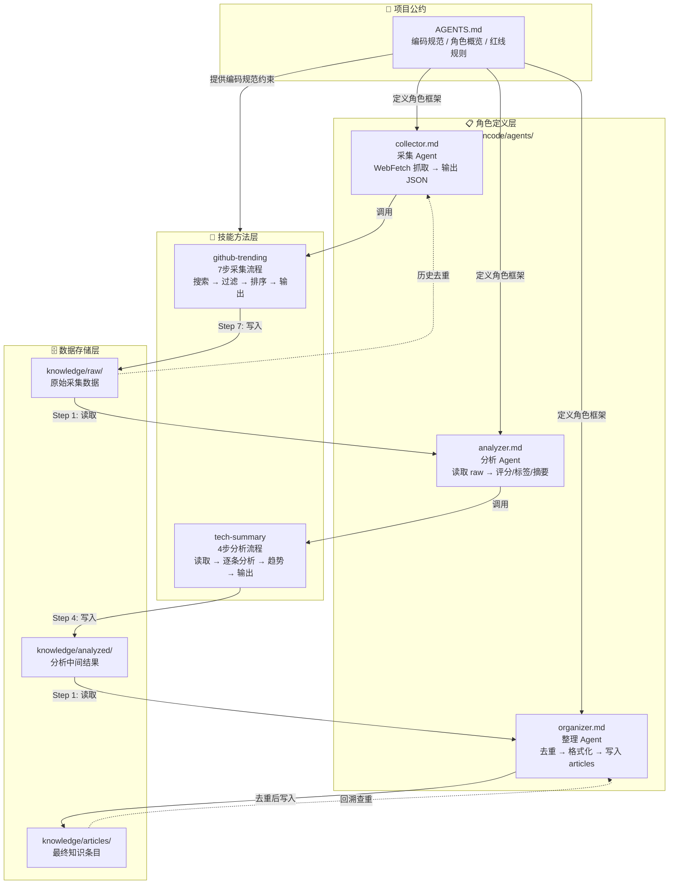

# 项目架构关系图

## 四层结构关系



## 关系说明

| 层级 | 角色 | 核心职责 |
|------|------|----------|
| **AGENTS.md** | 项目宪法 | 定义编码规范、角色分工、红线规则，是所有 Agent 的行为基准 |
| **agents/** | 组织架构 | 定义三个 Agent 的职责边界、权限声明、工作流程，解决"谁做什么" |
| **skills/** | 操作手册 | 提供可复用的任务级操作流程，解决"具体怎么做" |
| **knowledge/** | 数据仓库 | 按 raw → analyzed → articles 三级流水线存储，实现数据逐层加工 |

## 关键数据流

```
采集:  Collector + github-trending skill  → knowledge/raw/
分析:  Analyzer 读取 raw/ + tech-summary skill → knowledge/analyzed/
整理:  Organizer 读取 analyzed/ → 去重 → knowledge/articles/
```

## 关键控制流

```
AGENTS.md → agents/*.md（角色定义）→ skills/*/SKILL.md（操作方法）→ knowledge/（数据读写）
```
